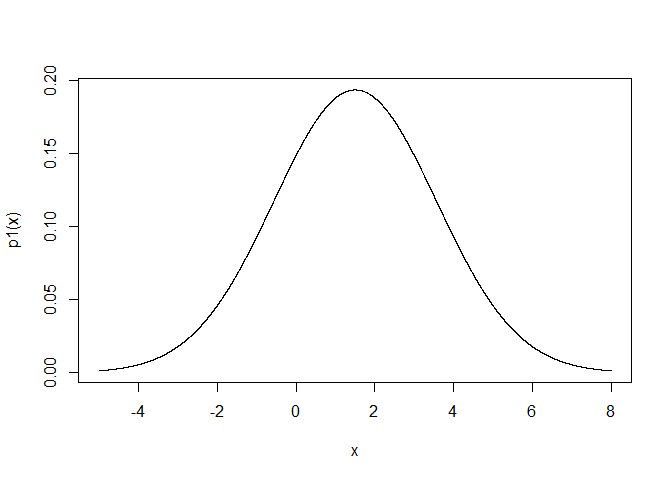

BDA3 Exercises: 1
================
Oscar Oelrich
11 november 2018

Suggested solutions to some of the exercises in Bayesian Data Analysis 3rd edition by Gelman et al.

Chapter 1
=========

Exercise 1.1
------------

### Part a

Since *θ* is a discrete variable which takes only the values 1 and 2, the marginal probability density for *y* will be obtained by summing over *θ*

$$\\begin{equation}
p(y) = \\sum\_{i=1}^2 p(y|\\theta\_i) p(\\theta\_i) = \\frac{1}{2}p(y|\\theta=1)+\\frac{1}{2}p(y|\\theta=2)
\\end{equation}$$
 . Using *σ* = 2 the density will be given by

$$\\begin{equation}
p(y)=\\frac{1}{2} \\frac{1}{\\sqrt{2\\pi 2^2}}e^{-(y-1)^2/(2\*2^2)}   + \\frac{1}{2}\\frac{1}{\\sqrt{2\\pi 2^2}}e^{-(y-2)^2/(2\*2^2)}= \\frac{1}{4\\sqrt{2\\pi}}\\left(e^{-(y-1)^2/(2\*2^2)}+e^{-(y-2)^2/(2\*2^2)}\\right)
\\end{equation}$$

We plot the density

``` r
p1 <- function(y) 0.25*(1/sqrt(2*pi))*(exp(-(y-1)^2/(2*2^2))+exp(-(y-2)^2/(2*2^2)))
# Or we could just use the build in densities from r...
#p2 <- function(y) 0.5*dnorm(y, 1, 2)+0.5*dnorm(y,2,2)
x <- seq(-5, 8, 0.001)
plot(x, p1(x), type = 'l')
```



### Part b

Using Bayes' theorem we have that

$$\\begin{equation}
p(\\theta=1|y=1) = \\frac{p(y=1|\\theta=1) p(\\theta=1)}{p(y=1)}
\\end{equation}$$

which we calculate to be

``` r
dnorm(1,1,2)*0.5/(0.5*dnorm(1, 1, 2)+0.5*dnorm(1,2,2))
```

    ## [1] 0.5312094

That is, after having observed *y* = 1 we update our believes favouring *θ* = 1, but not by much.

### Part c

Given that we have observed *y* = 1, decreasing the value of the variance means that the observation becomes less and less probable under the alternative *θ* = 2 and so the posterior will put more and more weight on *θ* = 1 as the variance decreases. As the variance increases, the probabilities under the two values will creep closer to each other and the posterior will get closer to the prior of $\\frac{1}{2}$.

Exercise 1.2
------------

We wish to show that the following hold when *u* is a vector

𝔼(*u*)=𝔼(𝔼(𝕦|𝕧))

var(*u*)=𝔼(var(𝕦|𝕧)) + var(𝔼(*u*|*v*))

We start with the conditional mean.

Exercise 1.6
------------

Approximately 1/125 of all births are fraternal twins, and approximately 1/300 of all births are identical twins. Elvis Presley had a twin brother who died at birth. Given the approximation that half of all births are boys, what is the probability that Elvis had a twin brother?

We will solve the problem using Bayes' theorem. We use the following notation.

-   *I**T* is the event of an identical twin
-   *F**T* is the event of a fraternal twin
-   *T* denotes the probability of having a twin and is obtained by summing *I**T* and *F**T*
-   *B* denotes the probability of having a brother

We then have that

$$\\begin{equation}
P((IT)|(T,B))=\\frac{P(T,B|(IT))P(IT)}{P(T,B)}
\\end{equation}$$

where we have that *P*(*T*, *B*|*I**T*)=1, since if Elvis has an identical twin, obviously it's a brother, the probability for *I**T* is given and the probability *P*(*T*, *B*)=*P*(*I**T*, *B*)+*P*(*F**T*, *B*)=*P*(*I**T*)+*P*(*B*|*F**T*)*P*(*F**T*)=1/300 + 1/2 \* 1/125 which gives the solution

$$\\begin{equation}
P((IT)|(T,B))=\\frac{1\*\\frac{1}{300}}{\\frac{1}{300}+\\frac{1}{2}\\frac{1}{125}}=\\frac{5}{11}
\\end{equation}$$
